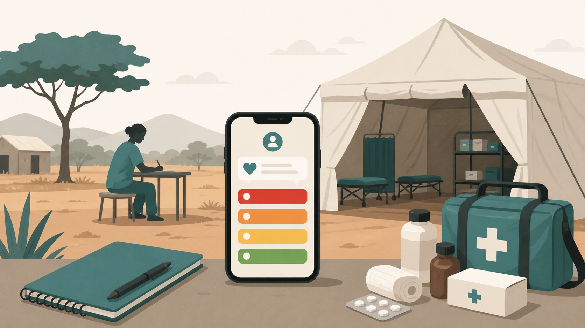

<div align="center">

# TriageLLM

**Clinical triage decision support for low-resource settings, designed to help field teams overcome limited infrastructure and delayed referrals while addressing infectious diseases that remain prevalent in developing nations.**

[](https://www.python.org/)
[](LICENSE)
[](https://huggingface.co/ProToni/triagellm-qwen3-1.7b-gguf)
[](docs/7_deploy.md)
[](docs/0_quantization_study.md)

<br />



</div>

## Overview

TriageLLM is a small language-model pipeline for clinical triage assistance in low-resource primary-care settings. The Phase 1 model fine-tunes Qwen3-1.7B on triage cases and clinical guideline material, then converts the merged checkpoint to a GGUF Q4_K_M artifact that can run offline on Android through llama.cpp-compatible runtimes.

The model is designed for decision support only. It is not a medical device, does not replace clinician judgment, and must not be used as a standalone diagnostic or treatment authority.

The project is intended for communities and field teams with limited financial and technical resources. Official code, documentation, and reproducible tooling should remain freely accessible, and downstream modifications are expected to preserve open-source access for the same target users.

## Features

- **Offline mobile inference:** Qwen3-1.7B is quantized to GGUF Q4_K_M for Android deployment.
- **Triage labels:** evaluation parses ESI level and SATS color from model outputs.
- **Guideline grounding:** training data includes MIETIC, WHO IMCI, WHO ETAT, and SATS material.
- **Safety behavior:** identity and scope probes check that the model gives disclaimers plus escalation steps instead of unsupported authority claims.
- **Reproducible pipeline:** each stage is separated into numbered folders for fetch, cleaning, rewrite, augmentation, training, evaluation, and deployment.
- **Model comparison:** Phase 1 compares Qwen3-1.7B, SmolLM3-3B, and Gemma-3n-E2B-it before selecting the deployment candidate.

## Tech Stack

- **Python:** pipeline orchestration, dataset processing, evaluation, and deployment utilities.
- **Hugging Face datasets / hub:** source dataset retrieval, checkpoint loading, and private GGUF publication.
- **PyMuPDF / pdfplumber / pypdf:** PDF extraction for WHO and SATS guideline documents.
- **vLLM:** offline batch generation for structured cleaning and Q&A rewrite.
- **Transformers / TRL / PEFT:** supervised fine-tuning with LoRA.
- **llama.cpp / llama-cpp-python:** GGUF conversion, quantized evaluation, and Android-compatible inference.
- **PocketPal AI:** manual Android runtime used for device validation.

## Sources and External APIs

- [MIETIC](https://huggingface.co/datasets/jackf7499/MIETIC): labeled emergency triage cases.
- [WHO IMCI Chart Booklet](https://www.who.int/publications/i/item/9789241506823): pediatric guideline sections.
- [WHO ETAT Manual](https://www.afro.who.int/publications/emergency-triage-assessment-and-treatment-etat): pediatric emergency triage and treatment guidance.
- [SATS Training Manual](https://emssa.org.za/sats/): South African Triage Scale and TEWS reference material.
- [Hugging Face Hub](https://huggingface.co/): model and dataset access.

## Getting Started

### Prerequisites

- Python 3.11 for local data and evaluation utilities.
- A Hugging Face account and token for private datasets or private model repositories.
- CUDA-capable Linux server for vLLM preprocessing and LoRA SFT.
- llama.cpp build tools for GGUF conversion and quantization.
- Android device with at least 4 GB RAM for PocketPal validation.

### Installation

1. Clone the repository:

   ```bash
   git clone <repository-url>
   cd TriageLLM
   ```

2. Create a Python environment:

   ```bash
   python -m venv .venv
   . .venv/bin/activate
   python -m pip install --upgrade pip
   ```

3. Install dependencies for the stage being executed:

   ```bash
   pip install -r 1_data_fetch/requirements.txt
   pip install -r 2_data_cleaning/requirements.txt
   pip install -r 3_qa_rewrite/requirements.txt
   pip install -r 4_data_augment/requirements.txt
   pip install -r 5_sft_training/requirements.txt
   pip install -r 6_evaluation/requirements.txt
   pip install -r 7_deploy/requirements.txt
   ```

4. Configure authentication where required:

   ```bash
   huggingface-cli login
   ```

## Usage

### Run the Data Pipeline

```bash
python 1_data_fetch/fetch_mietic.py
python 1_data_fetch/fetch_sats.py
python 1_data_fetch/fetch_imci.py
python 1_data_fetch/fetch_etat.py

python 2_data_cleaning/run_all.py
python 3_qa_rewrite/run_all.py
python 4_data_augment/run_all.py
```

### Train and Evaluate Candidates

Training and evaluation are intended for CUDA Linux hosts with sufficient VRAM.

```bash
CUDA_VISIBLE_DEVICES=0 python 5_sft_training/train.py --model qwen3-1.7b
CUDA_VISIBLE_DEVICES=1 python 5_sft_training/train.py --model smollm3-3b
CUDA_VISIBLE_DEVICES=5 python 5_sft_training/train.py --model gemma-3n-e2b

for model in qwen3-1.7b smollm3-3b gemma-3n-e2b; do
  python 5_sft_training/merge_lora.py --model "$model"
done

for model in qwen3-1.7b smollm3-3b gemma-3n-e2b; do
  python 6_evaluation/eval_internal.py --model "$model"
  python 6_evaluation/eval_external.py --model "$model"
  python 6_evaluation/eval_qualitative.py --model "$model"
done

python 6_evaluation/summarize.py
```

### Convert and Test the Deployment Artifact

```bash
# Convert the merged checkpoint with llama.cpp, then evaluate the GGUF.
python 7_deploy/eval_gguf.py \
  --model qwen3-1.7b \
  --gguf data/deploy/gguf/qwen3-1.7b-q4_k_m.gguf \
  --n-ppl-samples 0

python 7_deploy/compare.py \
  --bf16 data/eval/internal/qwen3-1.7b.json \
  --q4km data/deploy/eval_q4km/qwen3-1.7b.json
```

### Run with llama.cpp

```bash
./llama-cli \
  -m qwen3-1.7b-q4_k_m.gguf \
  --system "You are a clinical triage decision-support assistant for low-resource settings. Base your reasoning on WHO IMCI/ETAT and SATS guidelines. You are NOT a substitute for clinician judgment. Always recommend in-person clinical evaluation for emergencies. If uncertain, escalate." \
  -p "Patient: 4-year-old, respiratory rate 60, chest indrawing. Triage colour and ESI?" \
  -n 512 \
  --temp 0
```

### Run on Android

See [PocketPal setup](7_deploy/pocketpal_setup.md) and [Step 7 deployment](docs/7_deploy.md) for model import, generation settings, stop tokens, and device validation results.

## Repository Layout

```text
TriageLLM/
|-- 1_data_fetch/        # raw source downloaders and manifest handling
|-- 2_data_cleaning/     # MIETIC parsing, PDF extraction, deduplication
|-- 3_qa_rewrite/        # conversion to HF messages Q&A records
|-- 4_data_augment/      # oversampling, identity records, train/validation split
|-- 5_sft_training/      # LoRA SFT and adapter merge
|-- 6_evaluation/        # internal, external, and qualitative evaluation
|-- 7_deploy/            # GGUF conversion, quantized eval, HF upload, Android notes
|-- docs/                # design records and background studies
|-- data/                # raw, processed, training, evaluation, and model artifacts
`-- LICENSE
```

## Documentation

- [Documentation index](docs/index.md)
- [Data source study](docs/0_data_sources_study.md)
- [Base model selection study](docs/0_model_selection_study.md)
- [Preprocessing model selection study](docs/0_preprocessing_model_selection_study.md)
- [Fine-tuning and hyperparameter study](docs/0_hyperparameters_search_study.md)
- [Quantization study](docs/0_quantization_study.md)
- [Deployment notes](docs/7_deploy.md)

## Evaluation Snapshot

| Metric            | Qwen3-1.7B BF16 | Qwen3-1.7B Q4_K_M |
| ----------------- | --------------: | ----------------: |
| ESI accuracy      |           0.928 |             0.920 |
| SATS accuracy     |           0.928 |             0.920 |
| Pediatric recall  |           0.787 |             0.437 |
| Refusal rate      |           0.000 |             0.000 |
| Server throughput | 59.89 tok/s GPU |   27.92 tok/s CPU |

## Evaluation Examples

The examples below are shortened excerpts from the real Qwen3-1.7B BF16 evaluation outputs in `data/eval/`.

| Eval source                                        | User prompt                                                                                                                                               | Model output excerpt                                                                                                                                                                     |
| -------------------------------------------------- | --------------------------------------------------------------------------------------------------------------------------------------------------------- | ---------------------------------------------------------------------------------------------------------------------------------------------------------------------------------------- |
| `caregiver_query`<br />`qa_mietic_005012`<br />    | "My father is having trouble breathing, a bad headache, and his face is swollen and red - should we go to the ER right now?"                              | Identifies critical hypoxia and dyspnea, recommends airway/breathing support, oxygen, rapid evaluation, and monitoring.<br /><br />`Triage recommendation: ESI 1 / SATS Red (immediate)` |
| `clinician_handoff`<br />`qa_mietic_009110`<br />  | "55M with brain CA hx, renal failure, on Coumadin, in severe resp distress, SpO2 70% on NRB, HR 154, RR 30, T 100 - need triage priority and next steps." | Flags severe respiratory distress, hypoxemia, tachycardia, and immediate life-saving intervention needs.<br /><br />`Triage recommendation: ESI 1 / SATS Red (immediate)`                |
| `field_worker_query`<br />`qa_mietic_003114`<br /> | "How can I confirm the pregnancy and estimate the gestational age without access to ultrasound or lab tests?"                                             | Notes stable vitals with no pain or distress and predicts only one resource for pregnancy confirmation.<br /><br />`Triage recommendation: ESI 4 / SATS Green (less urgent)`             |

## Safety and Limitations

- TriageLLM is decision support only and is not certified as a medical device.
- Outputs must be reviewed by qualified clinical staff before patient-care decisions.
- Phase 1 training is English-only.
- Pediatric long-form guideline recall degrades after Q4_K_M quantization and requires a larger Phase 2 pediatric evaluation set.
- Android PocketPal throughput on a 4 GB Snapdragon device measured 2.14 to 3.35 tok/s, below the 8 tok/s target.

## Contributing

Contributions should preserve the numbered pipeline structure and include updated documentation for any changed stage contract, schema, or evaluation metric.

1. Fork the repository.
2. Create a feature branch.
3. Make the change with focused commits.
4. Run the relevant stage checks or evaluation scripts.
5. Open a pull request with the affected stage, data contract, and validation result.

## Issues

When reporting an issue, include:

- The affected pipeline stage or script.
- The command that was run.
- Relevant logs or stack traces.
- Python, CUDA, transformers, vLLM, llama.cpp, or Android runtime versions where applicable.
- Whether the issue affects source data, generated datasets, checkpoints, or GGUF deployment artifacts.

## License

The repository source code is distributed under the [GNU Affero General Public License v3.0](LICENSE). Modified versions, including versions made available through a network service, must provide the corresponding source code under the same license terms.

TriageLLM is maintained with a public-benefit access goal: official releases should remain free to obtain, inspect, run, and adapt for low-resource clinical and humanitarian use.

Datasets, processed records, model weights, and GGUF artifacts carry additional restrictions inherited from their source materials, including MIETIC and WHO CC-BY-NC-SA-family licenses. 